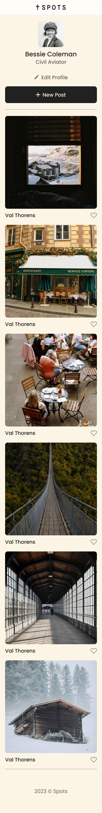

# Project 3: Spots

An image sharing site.

### Overview

- Intro
- Tech Stack
- Figma
- Images
- Deployment

**Intro**

This project is an image sharing site, designed such that all elements are displayed correctly on popular screen sizes.

**Tech Stack**

- HTML
- CSS
- Responsive Design

**Figma**

- [Link to the project on Figma](https://www.figma.com/file/BBNm2bC3lj8QQMHlnqRsga/Sprint-3-Project-%E2%80%94-Spots?type=design&node-id=2%3A60&mode=design&t=afgNFybdorZO6cQo-1)

**Images**

**Deployment**

This webpage is deployed to GitHub Pages

- [Deployment Link](https://ioannisyannou.github.io/se_project_spots/)
